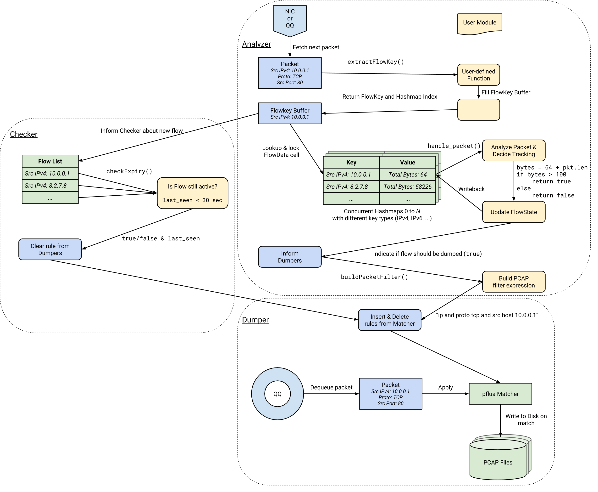
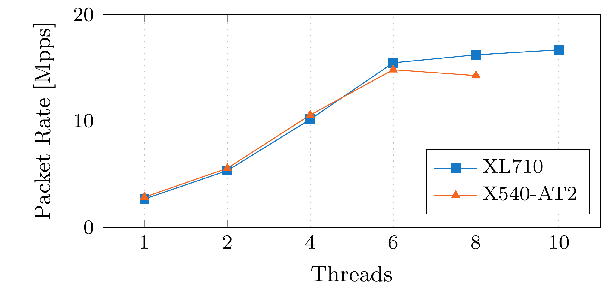
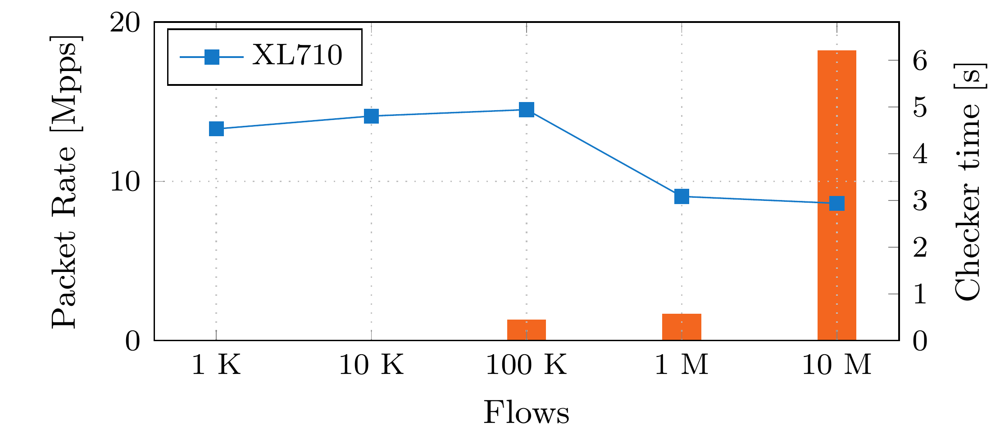

FlowScope is an oscilloscope for your network traffic. It records all traffic continuously in a ring buffer and dumps specific flows to disk on trigger events.
Triggers can be packets matching a user-defined filter.

[Read our new and updated paper](https://www.net.in.tum.de/fileadmin/bibtex/publications/papers/FlowScope-flow-tracking.pdf) (CloudNet 2018, [BibTeX](https://www.net.in.tum.de/publications/bibtex/FLowScopeCloudNet18.bib)) about FlowScope to learn more about FlowScope's architecture and flow tracking capabilities.

Our [older publication](https://www.net.in.tum.de/fileadmin/bibtex/publications/papers/FlowScope.pdf) (IFIP Networking 2017, [BibTeX](https://www.net.in.tum.de/publications/bibtex/FlowScope17.bib)) focuses on our QQ data structure used for time-traveling network debugging.


# Architecture



FlowScope consists of 3 different task that classify, analyze and dump packets.
These can be programmed and modified by user modules written in Lua.

Further it uses the QQ ring buffer which allows non-destructive early dequeuing (peeking) at the head and the ``concurrent_hash_map`` from [TBB](https://www.threadingbuildingblocks.org/docs/help/index.htm).

Due to their nature as C++ template classes, ``concurrent_hash_map``s need to be instantiated with known key and value types at compile time. But this would require a module author to write their own bindings for their wanted flow keys and values. As this is bothersome, we already define and bind multiple versions of the hash maps with type agnostic byte arrays of common sizes. As long as a key/value fits in one of the byte arrays, a hash map can be created dynamically at run time with any type.


# QQ (Queue-in-Queue) Ringbuffer

FlowScope can use the QQ ringbuffer to keep packets in memory instead of discarding them immediately. 
QQ consists of 2 levels of nested queues; the outer queue holding references to the inner ones, and the inner queues actually storing the data. This layered design improves multi-threaded performance by reducing the contention for the mutex guarding access. Instead of acquiring the lock on every insert/dequeue, threads get a complete inner queue exclusively for a short time.
This model works nicely with the common receive-side scaling (RSS) optimization in NICs, because QQ perseveres intra-flow packet ordering.
The inner queues store variably sized objects (like packets) tightly packed without losing useful properties like random access.

Further, QQ allows access to elements a the queue head without dequeuing them, so that analyzers see new packets as soon as possible. Contrary to other buffers QQ aims to be as filled as possible. It does not allow dequeuing packets until the fill level reaches the high water mark, so that as many as possible packets are still available in case of detected anomalies.


## Analyzer

The Analyzer(s) dequeues packets either directly from a NIC or through an intermediary ring buffer (QQ) as soon as they arrive (``rte_eth_rx_burst()``/``QQ_peek()``). With the ``extractFlowKey()`` function each packet is classified into one of the N flow tables by extracting its identifying flow feature (e.g. 5-Tuple, IP ID, etc.). This process is idempotent and does not yet involve any state. Basic pre-filtering can be performed very cheaply here, e.g., by discarding IPv4 traffic in an IPv6-only measurement. The function therefore returns if a packet is interesting at all and to which hash table it belongs. The Checker is informed about every interesting packet.

From the flow key the flow state is looked up in the corresponding hash table. This locks the cell for exclusive read-write access until the user module function ``handlePacket()`` returns.
``handlePacket()`` can perform arbitrary flow analysis based on the flows previous state and the current packet and updates the flow state with new data. Should a threshold be passed or an anomaly be identified, the function can request the archival of this flow by returning ``true`` (For efficiency reasons this should only happen once per flow. A simple bool flag in the flow state usually suffices). 

For such flows a PCAP filter expression has then to be build by the module in the ``buildPacketFilter()`` function.


## Checker

Since the modules ``handlePacket()`` function is only called for arriving packets, there would be no way to detect and delete inactive flows. Therefore a checker iterates over all flows in the hash tables in regular intervals and passes them to the ``checkExpiry()`` module function. Here the user can decide if a flow is still active, by, e.g. keeping the timestamp of the last seen packet or protocol specific flags (e.g. TCP fin). Should a flow deemed inactive, it is purged from the hash map and the dumpers are instructed to forget its matching filter rule.

<i>Due to technical limitations hash tables generally are not concurrently iterable and write-able. As a workaround we store every key in an array and just iterate of this array instead.</i>


## Dumper

Dumpers dequeue packets from the QQ ring buffer as late as possible to maximize the amount of information available in case of a detected anomaly.

The [pflua](https://github.com/Igalia/pflua) framework is used to facilitate high performance packet matching with the familiar PCAP filter syntax. More precisely the [pfmatch](https://github.com/Igalia/pflua/blob/master/doc/pfmatch.md) dialect, also seen in Snabb, is used. It is more powerful then normal pflang filters as it directly attaches functions to matches instead of just returning a yes/no filter decision. Together with the Lua-JIT compiler this allows better optimization and direct dumping to the appropriate per-flow pcap file.

Due to their (possibly immensely) delayed processing of the packets, rules can not be immediately discarded once a flow is inactive or the capture of interesting flows could end early, leading to missing packets. If the Checkers requests deletion of of a flow rule, the timestamp of the last seen packet is also included. With this Dumpers know exactly when it is safe to finally forget about a rule; if the other dequeued packets in QQ are older than the timestamp.


## Simple Example - Flow Statistics

The following describes the inner workings off FlowScope and the stages a packets passes through on the example of the flow statistics user module [examples/liveStatistician.lua](https://github.com/pudelkoM/FlowScope/blob/master/examples/liveStatistician.lua) which calculates traffic metrics for IP flows.

To get access to utility functions for time, protocol parsing and libmoon itself, the module import them in [lines 1-6](https://github.com/pudelkoM/FlowScope/blob/master/examples/liveStatistician.lua#L1-L6).

Next the modules defines local variables that are not exposed to the FlowScope driver. This can be configuration or values required for calculations, like here. flowStatistician defines a flow as expired once no packet has arrived in [30 seconds](https://github.com/pudelkoM/FlowScope/blob/master/examples/liveStatistician.lua#L10).

### Analyzer

Next come the required module definitions so that FlowScope knows what to initialize and which functions to call. Lines [12 to 22](https://github.com/pudelkoM/FlowScope/blob/master/examples/liveStatistician.lua#L12-L22) define a C struct which encapsulates the state of a flow. In [module.stateType](https://github.com/pudelkoM/FlowScope/blob/master/examples/liveStatistician.lua#L25) this type is exposed, so that FlowScope can instantiate the hash tables with this as the value type. It is possible to give an alternative default state to all-zeros with [module.defaultState](https://github.com/pudelkoM/FlowScope/blob/master/examples/liveStatistician.lua#L26).
Lastly the flow key types are defined. Since FlowScope already comes with a IP 5-Tuple key and extraction function, it is reused from the tuple lib.

With the flowkey extracted the associated flow state is looked up from the hash table and the [handlePacket](https://github.com/pudelkoM/FlowScope/blob/master/examples/liveStatistician.lua#L29) function is called.

### Checker

Next is the checker configured. [module.checkInterval](https://github.com/pudelkoM/FlowScope/blob/master/examples/liveStatistician.lua#L42) sets how often it should run. Here it is set to observe 5 seconds intervals of traffic.
With the [checkInitializer](https://github.com/pudelkoM/FlowScope/blob/master/examples/liveStatistician.lua#L44) a module can perform setup actions for the checker state. It is run once per checker-run, at the very beginning, before any flow is accessed. Here the module sets some counters and an empty list for the top X flows ([L45-49](https://github.com/pudelkoM/FlowScope/blob/master/examples/liveStatistician.lua#L45-L49)).

The [checkExpiry](https://github.com/pudelkoM/FlowScope/blob/master/examples/liveStatistician.lua#L67) function is then called for every flow currently present in the hash tables. In its arguments it holds the flow key, flow state and checker state.
The module calculates various [traffic metrics](https://github.com/pudelkoM/FlowScope/blob/master/examples/liveStatistician.lua#L70-L72) such as bits per second and packets per second and then [compares](https://github.com/pudelkoM/FlowScope/blob/master/examples/liveStatistician.lua#L52-L65) this flow to the others if it contains more traffic.
For the next checker run, the counters of a flow are [reset](https://github.com/pudelkoM/FlowScope/blob/master/examples/liveStatistician.lua#L80-L83).
Further it adds this flows metric to a [global counter](https://github.com/pudelkoM/FlowScope/blob/master/examples/liveStatistician.lua#L77-L78) to also get data about the total amount traffic.

Lastly the checker decides if a flow is still active by comparing its last seen value (filled in by the analyzers) to the current time ([L85-90](https://github.com/pudelkoM/FlowScope/blob/master/examples/liveStatistician.lua#L85-L90)).

At the end of a run, the collected data is printed out in the [checkFinalizer](https://github.com/pudelkoM/FlowScope/blob/master/examples/liveStatistician.lua#L93-L101) function.

### Path of a Packet

First the flow key has to be extracted from the packet. This is done in the [extractIP5Tuple](https://github.com/pudelkoM/FlowScope/blob/master/lua/tuple.lua#L96) and [extractIP5TupleUni](https://github.com/pudelkoM/FlowScope/blob/master/lua/tuple.lua#L72) functions. By using libmoon's packet library stack the packet is layer-for-layer unwrapped and the key buffer is [filled](https://github.com/pudelkoM/FlowScope/blob/master/lua/tuple.lua#L76-L88) with the information. 

## Advanced Example - TTL Analysis

# Installation

1. `git submodule update --init --recursive`
2. Compile libmoon in the `libmoon` submodule. Follow instructions [there](https://github.com/libmoon/libmoon#installation).
3. `cd build ; cmake .. ; make ; cd ..`
4. `./libmoon/build/libmoon lua/flowscope.lua --help`

FlowScope requires gcc 5 or later. You can use

    CC=gcc-5 CXX=g++-5 cmake ..

to set the compiler if gcc 5 is not your default.


# Usage

## Immediate mode without buffering/dumping

A simple test setup with synthetic traffic for quick testing can be built with two directly connected machines.

* Install FlowScope on host A und [libmoon](https://github.com/emmericp/libmoon) on host B
* Start monitoring on host A: ```./libmoon/build/libmoon lua/flowscope.lua examples/liveStatistician.lua <dev>```
* Run ```./build/libmoon examples/pktgen.lua --rate=5000 <dev>``` on host B

The `pktgen.lua` MoonGen script generates 1000 UDP flows in the subnet 10.0.0.0/16 on random ports in the range 1234 to 2234.

For a 40 Gbit XL710 NIC you should see similar output like this on the monitor host:
```
Top flows over sliding 5s window:
#       bps     pps     Flow
1 649586.24 10826.44 ipv4_5tuple{ip_a: 10.0.0.10, ip_b: 10.1.0.10, port_a: 2143, port_b: 1234, proto: udp}
2 648500.83 10808.35 ipv4_5tuple{ip_a: 10.0.0.10, ip_b: 10.1.0.10, port_a: 1950, port_b: 1234, proto: udp}
3 647902.81 10798.38 ipv4_5tuple{ip_a: 10.0.0.10, ip_b: 10.1.0.10, port_a: 2164, port_b: 1234, proto: udp}
[...]
Active flows 1000, cumulative packets 53329880 [10665976.00/s], cumulative bytes 3199792800 [639958560.00/s], took 0.00s
```

# Hardware Requirements

1. A CPU with a constant and invariant TSC. All recent Intel CPUs (Nehalem or newer) have this feature.
2. See [libmoon](https://github.com/emmericp/libmoon)

# Mini Benchmark

The following mini benchmark show the processing rate of FlowScope analyzer threads when doing no analysis on packets.
To minimize influence of module functions, the benchmark was created with the noop.lua module which does only extract IP 5-Tuples and accesses the hash tables, but does not calculate anything. It more or less measures the upper performance bound.

Packet rates for 1 M flows:


Packet rates for 4 Threads:

